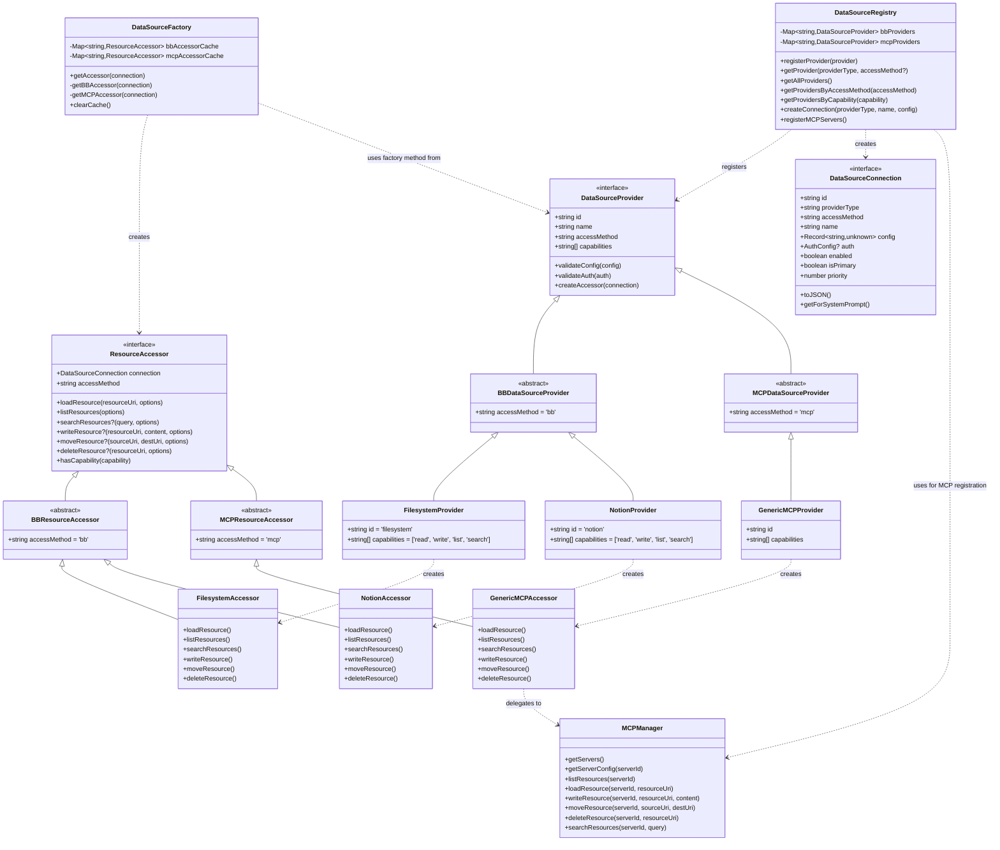
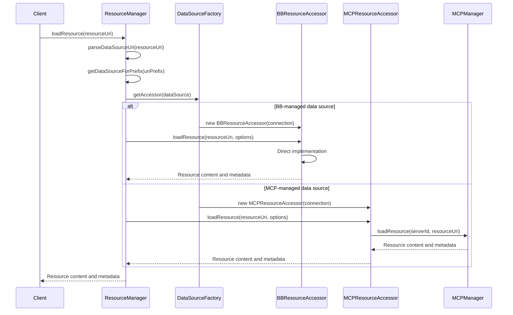
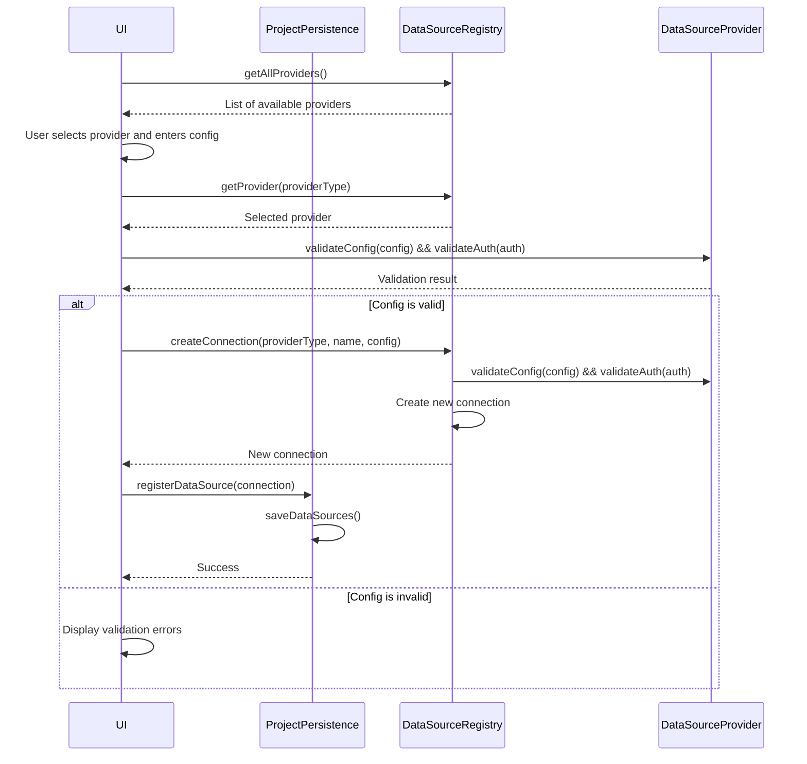
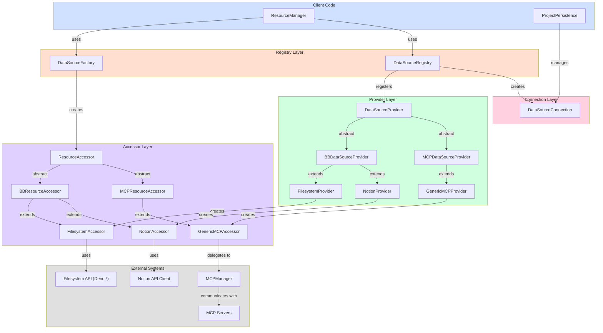

# Data Source Architecture Diagrams

## Class Diagram

```mermaid
classDiagram
    %% Interfaces
    class DataSourceProvider {
        <<interface>>
        +string id
        +string name
        +string accessMethod
        +string[] capabilities
        +validateConfig(config)
        +validateAuth(auth)
        +createAccessor(connection)
    }
    
    class DataSourceConnection {
        <<interface>>
        +string id
        +string providerType
        +string accessMethod
        +string name
        +Record~string,unknown~ config
        +AuthConfig? auth
        +boolean enabled
        +boolean isPrimary
        +number priority
        +toJSON()
        +getForSystemPrompt()
    }
    
    class ResourceAccessor {
        <<interface>>
        +DataSourceConnection connection
        +string accessMethod
        +loadResource(resourceUri, options)
        +listResources(options)
        +searchResources?(query, options)
        +writeResource?(resourceUri, content, options)
        +moveResource?(sourceUri, destUri, options)
        +deleteResource?(resourceUri, options)
        +hasCapability(capability)
    }
    
    %% Abstract Classes
    class BBDataSourceProvider {
        <<abstract>>
        +string accessMethod = 'bb'
    }
    
    class MCPDataSourceProvider {
        <<abstract>>
        +string accessMethod = 'mcp'
    }
    
    class BBResourceAccessor {
        <<abstract>>
        +string accessMethod = 'bb'
    }
    
    class MCPResourceAccessor {
        <<abstract>>
        +string accessMethod = 'mcp'
    }
    
    %% Concrete Provider Classes
    class FilesystemProvider {
        +string id = 'filesystem'
        +string[] capabilities = ['read', 'write', 'list', 'search']
    }
    
    class NotionProvider {
        +string id = 'notion'
        +string[] capabilities = ['read', 'write', 'list', 'search']
    }
    
    class GenericMCPProvider {
        +string id
        +string[] capabilities
    }
    
    %% Concrete Accessor Classes
    class FilesystemAccessor {
        +loadResource()
        +listResources()
        +searchResources()
        +writeResource()
        +moveResource()
        +deleteResource()
    }
    
    class NotionAccessor {
        +loadResource()
        +listResources()
        +searchResources()
        +writeResource()
        +moveResource()
        +deleteResource()
    }
    
    class GenericMCPAccessor {
        +loadResource()
        +listResources()
        +searchResources()
        +writeResource()
        +moveResource()
        +deleteResource()
    }
    
    %% Utility Classes
    class DataSourceRegistry {
        -Map~string,DataSourceProvider~ bbProviders
        -Map~string,DataSourceProvider~ mcpProviders
        +registerProvider(provider)
        +getProvider(providerType, accessMethod?)
        +getAllProviders()
        +getProvidersByAccessMethod(accessMethod)
        +getProvidersByCapability(capability)
        +createConnection(providerType, name, config)
        +registerMCPServers()
    }
    
    class DataSourceFactory {
        -Map~string,ResourceAccessor~ bbAccessorCache
        -Map~string,ResourceAccessor~ mcpAccessorCache
        +getAccessor(connection)
        -getBBAccessor(connection)
        -getMCPAccessor(connection)
        +clearCache()
    }
    
    class MCPManager {
        +getServers()
        +getServerConfig(serverId)
        +listResources(serverId)
        +loadResource(serverId, resourceUri)
        +writeResource(serverId, resourceUri, content)
        +moveResource(serverId, sourceUri, destUri)
        +deleteResource(serverId, resourceUri)
        +searchResources(serverId, query)
    }
    
    %% Relationships
    DataSourceProvider <|-- BBDataSourceProvider
    DataSourceProvider <|-- MCPDataSourceProvider
    
    BBDataSourceProvider <|-- FilesystemProvider
    BBDataSourceProvider <|-- NotionProvider
    MCPDataSourceProvider <|-- GenericMCPProvider
    
    ResourceAccessor <|-- BBResourceAccessor
    ResourceAccessor <|-- MCPResourceAccessor
    
    BBResourceAccessor <|-- FilesystemAccessor
    BBResourceAccessor <|-- NotionAccessor
    MCPResourceAccessor <|-- GenericMCPAccessor
    
    DataSourceRegistry ..> DataSourceProvider : registers
    DataSourceRegistry ..> DataSourceConnection : creates
    DataSourceRegistry ..> MCPManager : uses for MCP registration
    
    DataSourceFactory ..> ResourceAccessor : creates
    DataSourceFactory ..> DataSourceProvider : uses factory method from
    
    FilesystemProvider ..> FilesystemAccessor : creates
    NotionProvider ..> NotionAccessor : creates
    GenericMCPProvider ..> GenericMCPAccessor : creates
    
    GenericMCPAccessor ..> MCPManager : delegates to
```

## Sequence Diagram: Loading a Resource

```mermaid
sequenceDiagram
    participant Client
    participant ResourceManager
    participant DataSourceFactory
    participant BBResourceAccessor
    participant MCPResourceAccessor
    participant MCPManager
    
    Client->>ResourceManager: loadResource(resourceUri)
    ResourceManager->>ResourceManager: parseDataSourceUri(resourceUri)
    ResourceManager->>ResourceManager: getDataSourceForPrefix(uriPrefix)
    ResourceManager->>DataSourceFactory: getAccessor(dataSource)
    
    alt BB-managed data source
        DataSourceFactory->>BBResourceAccessor: new BBResourceAccessor(connection)
        ResourceManager->>BBResourceAccessor: loadResource(resourceUri, options)
        BBResourceAccessor->>BBResourceAccessor: Direct implementation
        BBResourceAccessor-->>ResourceManager: Resource content and metadata
    else MCP-managed data source
        DataSourceFactory->>MCPResourceAccessor: new MCPResourceAccessor(connection)
        ResourceManager->>MCPResourceAccessor: loadResource(resourceUri, options)
        MCPResourceAccessor->>MCPManager: loadResource(serverId, resourceUri)
        MCPManager-->>MCPResourceAccessor: Resource content and metadata
        MCPResourceAccessor-->>ResourceManager: Resource content and metadata
    end
    
    ResourceManager-->>Client: Resource content and metadata
```

## Sequence Diagram: Creating a New Data Source Connection

```mermaid
sequenceDiagram
    participant UI
    participant ProjectPersistence
    participant DataSourceRegistry
    participant DataSourceProvider
    
    UI->>DataSourceRegistry: getAllProviders()
    DataSourceRegistry-->>UI: List of available providers
    
    UI->>UI: User selects provider and enters config
    
    UI->>DataSourceRegistry: getProvider(providerType)
    DataSourceRegistry-->>UI: Selected provider
    
    UI->>DataSourceProvider: validateConfig(config) && validateAuth(auth)
    DataSourceProvider-->>UI: Validation result
    
    alt Config is valid
        UI->>DataSourceRegistry: createConnection(providerType, name, config)
        DataSourceRegistry->>DataSourceProvider: validateConfig(config) && validateAuth(auth)
        DataSourceRegistry->>DataSourceRegistry: Create new connection
        DataSourceRegistry-->>UI: New connection
        
        UI->>ProjectPersistence: registerDataSource(connection)
        ProjectPersistence->>ProjectPersistence: saveDataSources()
        ProjectPersistence-->>UI: Success
    else Config is invalid
        UI->>UI: Display validation errors
    end
```

## Component Overview Diagram

```mermaid
graph TD
    subgraph ClientCode[Client Code]
        ResourceManager
        ProjectPersistence
    end
    
    subgraph Registry[Registry Layer]
        DataSourceRegistry
        DataSourceFactory
    end
    
    subgraph Provider[Provider Layer]
        DSP[DataSourceProvider]
        BBDSP[BBDataSourceProvider]
        MCPDSP[MCPDataSourceProvider]
        FP[FilesystemProvider]
        NP[NotionProvider]
        GMCPP[GenericMCPProvider]
    end
    
    subgraph Connection[Connection Layer]
        DSC[DataSourceConnection]
    end
    
    subgraph Accessor[Accessor Layer]
        RA[ResourceAccessor]
        BBRA[BBResourceAccessor]
        MCPRA[MCPResourceAccessor]
        FA[FilesystemAccessor]
        NA[NotionAccessor]
        GMCPA[GenericMCPAccessor]
    end
    
    subgraph External[External Systems]
        MCPManager
        FilesystemAPI["Filesystem API (Deno.*)"]
        NotionAPI[Notion API Client]
        MCPServers[MCP Servers]
    end
    
    ResourceManager -->|uses| DataSourceFactory
    ResourceManager -->|uses| DataSourceRegistry
    ProjectPersistence -->|manages| DSC
    
    DataSourceRegistry -->|registers| DSP
    DataSourceRegistry -->|creates| DSC
    DataSourceFactory -->|creates| RA
    
    DSP -->|abstract| BBDSP & MCPDSP
    BBDSP -->|extends| FP & NP
    MCPDSP -->|extends| GMCPP
    
    RA -->|abstract| BBRA & MCPRA
    BBRA -->|extends| FA & NA
    MCPRA -->|extends| GMCPA
    
    FP -->|creates| FA
    NP -->|creates| NA
    GMCPP -->|creates| GMCPA
    
    FA -->|uses| FilesystemAPI
    NA -->|uses| NotionAPI
    GMCPA -->|delegates to| MCPManager
    MCPManager -->|communicates with| MCPServers
    
    style ClientCode fill:#d0e0ff
    style Registry fill:#ffe0d0
    style Provider fill:#d0ffe0
    style Connection fill:#ffd0e0
    style Accessor fill:#e0d0ff
    style External fill:#e0e0e0
```