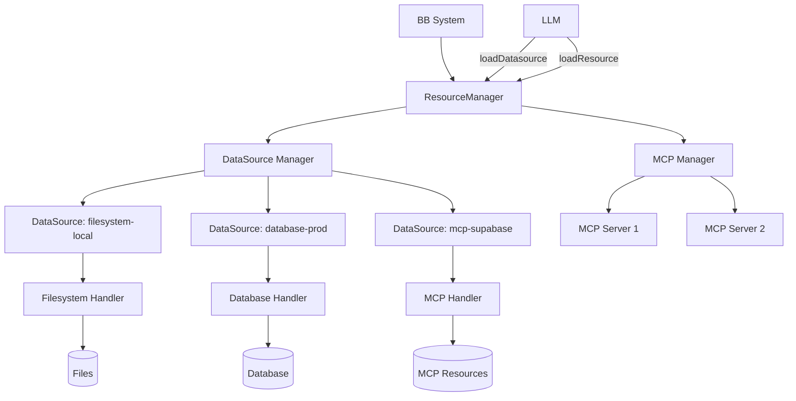
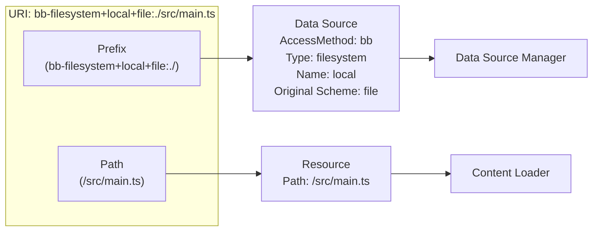
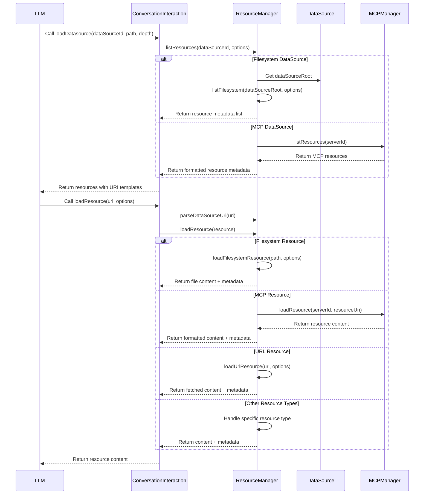
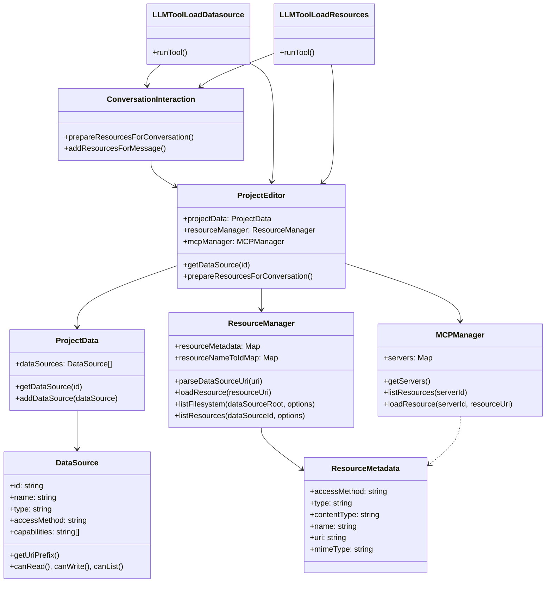

# BB Data Source and Resource Management System

## 1. Introduction

This document explains BB's new multi-data source architecture, which replaces the previous single `projectRoot` approach with a flexible collection of data sources. This system enables BB to interact with various content sources (filesystem, databases, Notion, MCP servers, etc.) through a unified interface.



## 2. Core Components

### 2.1. DataSource

The `DataSource` class is the foundation of the system, representing any source of data BB can interact with.

#### Key Properties

| Property | Description |
|----------|-------------|
| `id` | Unique identifier (used in URIs) |
| `name` | Human-readable name |
| `type` | Data source type (filesystem, database, mcp, etc.) |
| `accessMethod` | How BB accesses the source (bb or mcp) |
| `capabilities` | Operations supported (read, write, list, search) |
| `uriPrefix` | Optional URI prefix override |
| `config` | Source-specific configuration |
| `auth` | Authentication configuration |
| `mcpConfig` | MCP server configuration (if applicable) |

#### URI Prefix Generation

Each data source has a URI prefix formula:
```
{accessMethod}-{type}+{name}+{originalScheme}://
```

For example:
- A local filesystem data source: `bb-filesystem+local+file:.//path/to/file.txt`
- A Supabase MCP data source: `mcp-database+supabase+postgres://schema/table`

### 2.2. Resource

Resources are the items accessed through data sources. They're identified by URIs and come with metadata.

#### Resource Metadata Structure

```typescript
interface ResourceMetadata {
  accessMethod: 'bb' | 'mcp';
  type: 'file' | 'url' | 'mcp' | 'database' | 'memory' | 'api' | 'vector_search';
  contentType: 'text' | 'image';
  name: string;
  description?: string;
  uri: string;
  uriTemplate?: string;
  mimeType: string;
  path?: string;
  size?: number;
  lastModified?: Date;
  mcpData?: ResourceMCPConfig;
}
```

## 3. Resource Identification

The BB system uses a consistent approach to resource identification that preserves the connection between resources and their data sources.

### 3.1. Unified Resource Identifier Approach

Resources are identified by a URI that embeds data source information in the scheme, using a consistent structure with `+` delimiters.

**Format**: `{accessMethod}-{type}+{name}+{originalScheme}://{rest-of-uri}`

**Examples**:
- `bb-filesystem+local+file:./documents/report.pdf`
- `mcp-database+supabase-prod+postgres://database/customers/schema`
- `bb-notion+work-documents+x-notion://workspace/page123`



**Advantages**:
- Self-contained (single identifier)
- Valid URI syntax (supports all standard URI schemes)
- Unambiguous parsing even with dashed names and schemes
- Preserves the original URI structure
- Embeds data source metadata in the URI

### 3.2. Parsing Algorithm

To extract data source information and the original URI:

```typescript
function parseDataSourceUri(uri: string): { 
  uriPrefix: string;
  accessMethod: string,
  dataSourceType: string,
  dataSourceName: string,
  originalUri: string
  resourceType: string,
} {
  // Find the scheme delimiter - could be "://" or just ":"
  const stdDelimiterIndex = uri.indexOf('://');
  const colonIndex = uri.indexOf(':');

  let schemeEndIndex: number;
  let delimiter: string;

  if (stdDelimiterIndex !== -1 && stdDelimiterIndex === colonIndex) {
    // Standard "://" delimiter
    schemeEndIndex = stdDelimiterIndex;
    delimiter = '://';
  } else {
    // Simple ":" delimiter (like mailto:)
    schemeEndIndex = colonIndex;
    delimiter = ':';
  }

  if (schemeEndIndex === -1) {
    throw new Error('Invalid URI format');
  }

  const fullScheme = uri.substring(0, schemeEndIndex);
  const restOfUri = uri.substring(schemeEndIndex);

  // Split the fullScheme by "+" delimiters
  const prefixParts = fullScheme.split('+'); //{accessMethod}-{dataSourceType}+{dataSourceName}+{originalScheme}

  // Check for valid format
  if (prefixParts.length < 3) {
    throw new Error('Invalid data source URI format');
  }

  // Extract components
  const accessTypeParts = prefixParts[0].split('-'); //{accessMethod}-{dataSourceType}
  if (accessTypeParts.length !== 2) {
    throw new Error('Invalid prefix format');
  }

  const accessMethod = accessTypeParts[0]; // "bb" or "mcp"
  const dataSourceType = accessTypeParts[1]; // "filesystem", "database", etc.
  const dataSourceName = prefixParts[1]; // Normalized data source name
  const originalScheme = prefixParts[2]; // Original URI scheme

  const uriPrefix = `${accessMethod}-${dataSourceType}+${dataSourceName}`;
  // Reconstruct the original URI
  const originalUri = `${originalScheme}${restOfUri}`;

  const parsedOriginalUri = URL.parse(originalUri);
  let resourceType = '';
  if (parsedOriginalUri) {
    resourceType = parsedOriginalUri.protocol.slice(0, -1); // Removes trailing colon
  }

  return {
    uriPrefix,
    accessMethod,
    dataSourceType,
    dataSourceName,
    originalUri,
    resourceType,
  };
}
```

## 4. Resource Referencing Mechanism

The `loadResources` tool supports two resource referencing modes:

### 4.1. Template Mode

Uses a URI template and variable values to generate the complete resource URI.

```json
{
  "mode": "template",
  "uriTemplate": "bb-filesystem+local+file:./{path}",
  "templateResources": [
    { "path": "/src/config.ts" },
    { "path": "/tests/config.test.ts" }
  ]
}
```

This expands to:
- `bb-filesystem+local+file:./src/config.ts`
- `bb-filesystem+local+file:./tests/config.test.ts`

### 4.2. Direct Mode

Uses complete, pre-constructed URIs.

```json
{
  "mode": "direct",
  "directUris": [
    "bb-filesystem+local+file:./src/config.ts", 
    "bb-filesystem+local+file:./package.json"
  ]
}
```

## 5. Data Flow between Components



1. **LLM Tool Request Flow**:
   - LLM requests resource listing via `loadDatasource`
   - ResourceManager provides resource metadata list with URI templates
   - LLM requests specific resources via `loadResource` using complete URIs
   - ResourceManager extracts data source information, loads the resource, and returns content

2. **Resource Lookup**:
   - URI is parsed to extract data source information and original URI
   - Data source is located by type and name
   - Resource is loaded using the appropriate handler
   - Metadata is maintained for reference

## 6. Implementation Details

### 6.1. ResourceManager Class

The core orchestrator that manages resources across all data sources.

**Key Methods**:
- `parseDataSourceUri(uri)`: Extracts data source information and original URI
- `loadResource(resourceUri)`: Loads content from any resource
- `listFilesystem(dataSourceRoot, options)`: Lists filesystem resources
- `listResources(dataSourceId, options)`: Lists resources from any data source

### 6.2. MCPManager Class

Manages connections to MCP servers and retrieves resources from them.

**Key Methods**:
- `listResources(serverId)`: Lists resources from an MCP server
- `loadResource(serverId, resourceUri)`: Loads a specific MCP resource

## 7. Data Schemas

### 7.1. Resource URI Pattern

```
{accessMethod}-{type}+{name}+{originalScheme}://{rest-of-uri}
```

### 7.2. URI Template Expansion

```
template: "bb-filesystem+local+file:./{path}"
variables: { "path": "/src/main.ts" }
expanded: "bb-filesystem+local+file:./src/main.ts"
```

### 7.3. Resource Metadata Storage

ResourceManager maintains two maps:
1. `resourceMetadata`: Maps resource IDs to metadata
2. `resourceNameToIdMap`: Maps resource names to internal IDs

## 8. Recommendations for Implementation

Based on the current code and architecture, here are recommended approaches:

1. **Use Structured URIs**: Adopt the `{accessMethod}-{type}+{name}+{originalScheme}://{rest-of-uri}` format as the standard resource identifier.

2. **Metadata Storage**: Implement a persistent store for resource metadata indexed by URI to enable efficient lookups.

3. **URI Generation**: When generating URIs, normalize data source names to ensure consistency.

4. **Resource Loading**: Implement a central resource loading function that:
   - Parses the URI to extract data source information
   - Locates the appropriate data source
   - Delegates to the appropriate loader based on type
   - Returns both content and metadata

5. **Error Handling**: Implement robust error handling for cases like:
   - Data source not found
   - Resource not found
   - Access permission issues
   - Format/type mismatches

## 9. Component Interaction Diagram



## Conclusion

The new multi-data source architecture provides BB with a flexible, extensible system for working with diverse content sources. By adopting a consistent resource identification scheme using structured URIs with embedded data source information, developers can efficiently implement resource management operations while maintaining a clear mental model of how resources relate to their data sources.

The recommended approach uses URIs in the format `{accessMethod}-{type}+{name}+{originalScheme}://{rest-of-uri}` as the primary identifier for resources. This format is:

1. Syntactically valid according to URI standards
2. Unambiguous even with complex data source names or schemes
3. Self-contained (includes all necessary information)
4. Extensible to any type of resource
5. Clear about both data source details and the original resource location

This approach balances technical correctness, clarity, and maintainability while supporting the diverse range of data sources BB needs to interact with.