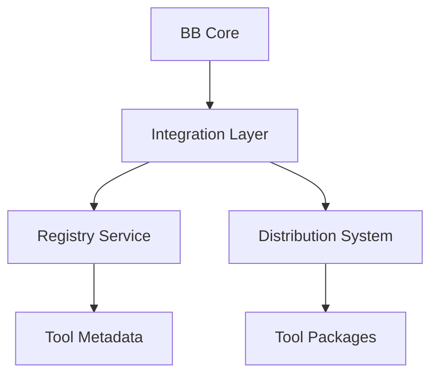
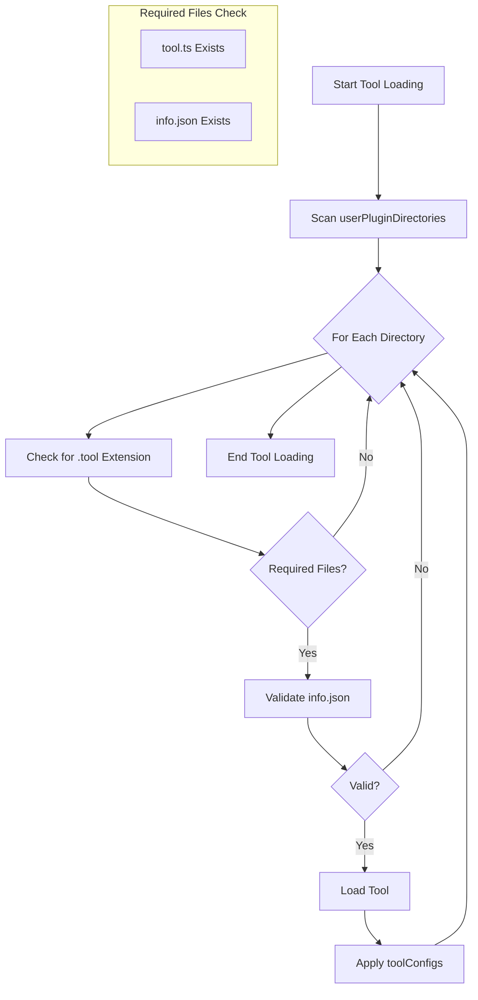

# BB Tool Library Reference

This document provides technical details about the BB Tool Library architecture, APIs, and integration points.

## Table of Contents

1. [Architecture](#architecture)
2. [Tool Package Structure](#tool-package-structure)
3. [Library APIs](#library-apis)
4. [Security Model](#security-model)
5. [Integration Points](#integration-points)
6. [Versioning](#versioning)
7. [Technical Requirements](#technical-requirements)

## Architecture

The BB Tool Library is built on three main components:

1. **Registry Service**
   - Tool metadata storage
   - Version management
   - Search and discovery
   - Access control

2. **Distribution System**
   - Package delivery
   - Version resolution
   - Dependency management
   - Update notifications

3. **Integration Layer**
   - BB core integration
   - Tool loading
   - Runtime management
   - Resource monitoring



## Tool Loading Process

BB uses a straightforward process to discover and load tools:



Tools that fail validation are silently skipped. The `userPluginDirectories` setting in BB's config specifies where to look for tools:

```yaml
api:
  userPluginDirectories:
    - ./plugins     # Relative to config file
    - /abs/path/to/plugins  # Absolute path
  toolConfigs:    # Tool-specific configurations
    run_command:
      allowedCommands:
        - git branch
        - ls
        - pwd
    multi_model_query:
      anthropicApiKey: sk-ant-xxxx
      models:
        - claude-3-haiku
        - gpt-4
```

🚧 Planned Feature: Tool Sets
- Tools can belong to sets (defined in info.json)
- Users can load specific tool sets
- Helps organize and manage tool collections

## Tool Package Structure

### Required Files

```
tool-package.tool/
│   tool.ts               # Main implementation
│   formatter.browser.tsx # Browser formatting
│   formatter.console.ts  # Console formatting
├── tests/
│   └── tool.test.ts         # Test suite
├── docs/
│   └── README.md            # Documentation
├── info.json                # Metadata
└── package.json             # Package config
```

### Metadata Schema (info.json)

```typescript
interface ToolMetadata {
  name: string;              // Tool name
  version: string;           // Semantic version
  description: string;       // Brief description
  author: string;           // Author name/organization
  license: string;          // License identifier
  category: ToolCategory;   // Primary category
  tags: string[];          // Search tags
  bb: {
    minVersion: string;    // Minimum BB version
    permissions: string[]; // Required permissions
    resourceIntensive: boolean; // Resource usage flag
  };
  repository: string;      // Source repository URL
  documentation: string;   // Documentation URL
  support: string;        // Support URL
  dependencies?: {        // Optional dependencies
    [name: string]: string;
  };
}

type ToolCategory =
  | 'File Operations'
  | 'Code Analysis'
  | 'Documentation'
  | 'Project Management'
  | 'Integration'
  | 'Utility';
```

## Library APIs

### Registry API

Base URL: `https://registry.bb.dev/api/v1`

#### Tool Registration
```typescript
POST /tools
Content-Type: application/json
{
  metadata: ToolMetadata;
  signature: string;     // Package signature
  checksum: string;     // Package checksum
}
```

#### Tool Search
```typescript
GET /tools/search
Query Parameters:
  - q: string           // Search query
  - category: string    // Filter by category
  - tags: string[]      // Filter by tags
  - author: string      // Filter by author
```

#### Version Management
```typescript
POST /tools/:name/versions
Content-Type: application/json
{
  version: string;      // New version
  metadata: ToolMetadata;
  changes: string[];    // Changelog
}
```

### Distribution API

Base URL: `https://dist.bb.dev/api/v1`

#### Package Download
```typescript
GET /packages/:name/:version
Response:
  Content-Type: application/x-bb-tool
  X-BB-Signature: string
  X-BB-Checksum: string
```

#### Update Check
```typescript
GET /updates/:name
Query Parameters:
  - current: string     // Current version
Response:
  {
    available: boolean;
    latest: string;     // Latest version
    required: boolean;  // Required update
  }
```

## Security Model

🚧 Planned Feature: The following security features are planned for future implementation.

### Package Signing

🚧 Planned Feature: All tool packages must be signed:
1. Developer generates key pair
2. Public key registered with BB
3. Packages signed before submission
4. Signatures verified on installation

### Permission System

Tools declare required permissions:
```json
{
  "bb": {
    "permissions": [
      "files.read",
      "files.write",
      "network.fetch",
      "system.exec"
    ]
  }
}
```

### Verification Process

🚧 Planned Feature: The following verification steps will be implemented:

1. **Static Analysis**
   - Code security scan
   - Dependency audit
   - Permission verification

2. **Dynamic Analysis**
   - Sandbox testing
   - Resource monitoring
   - Behavior analysis

3. **Manual Review**
   - Code review
   - Documentation review
   - Security assessment

## Integration Points

### BB Core Integration

Tools integrate through the @beyondbetter/tools package:

```typescript
import LLMTool from '@beyondbetter/tools';
import type {
  IConversationInteraction,
  IProjectEditor,
  LLMToolRunResult
} from '@beyondbetter/tools';

export class CustomTool extends LLMTool {
  // Implementation
}
```

### Runtime Loading

BB dynamically loads tools:
1. Tool discovery
2. Dependency resolution
3. Permission verification
4. Resource allocation

### Resource Management

Tools operate within constraints:
- Memory limits
- CPU usage caps
- Network quotas
- Storage restrictions

## Versioning

### Version Format

Tools use semantic versioning:
- Major: Breaking changes
- Minor: New features
- Patch: Bug fixes

### Compatibility

Version compatibility includes:
1. BB core version
2. Dependency versions
3. API versions
4. Feature flags

### Update Types

1. **Patch Updates**
   - Bug fixes
   - Security patches
   - Performance improvements

2. **Minor Updates**
   - New features
   - Enhanced functionality
   - Expanded capabilities

3. **Major Updates**
   - Breaking changes
   - Architecture changes
   - Permission changes

## Technical Requirements

### Performance

🚧 Planned Feature: Tools will be required to meet these performance criteria:
- Response time < 5s
- Memory usage < 100MB
- CPU usage < 50%
- Network efficiency

### Testing

Required test coverage:
- Unit tests: >80%
- Integration tests
- Performance tests
- Security tests

### Documentation

Technical documentation must include:
- API reference
- Type definitions
- Example code
- Error handling
- Performance notes

### Error Handling

Standardized error handling:
```typescript
interface ToolError {
  code: string;        // Error code
  message: string;     // User message
  details?: unknown;   // Technical details
  retry?: boolean;     // Can retry
}
```

### Logging

Structured logging format:
```typescript
interface ToolLog {
  level: 'debug' | 'info' | 'warn' | 'error';
  message: string;
  metadata: Record<string, unknown>;
  timestamp: string;
}
```

## Implementation Examples

### Basic Tool
```typescript
import LLMTool from '@beyondbetter/tools';

export class LLMToolExampleTool extends LLMTool {
  constructor() {
    super('example_tool', 'Example tool description');
  }

  get inputSchema() {
    return {
      type: 'object',
      properties: {
        param: { type: 'string' }
      }
    };
  }

  async runTool(
    interaction: IConversationInteraction,
    toolUse: LLMAnswerToolUse,
    projectEditor: IProjectEditor
  ): Promise<LLMToolRunResult> {
    // Implementation
  }
}
```

### Tool Integration

Tools are integrated by adding their directory to BB's configuration:

```yaml
api:
  userPluginDirectories:
    - ./tools     # Relative to config file
    - /abs/path/to/tools  # Absolute path
  toolConfigs:    # Tool-specific configurations
    run_command:
      allowedCommands:
        - git branch
        - ls
        - pwd
    multi_model_query:
      anthropicApiKey: sk-ant-xxxx
      models:
        - claude-3-haiku
        - gpt-4
```

BB will discover and load any `.tool` directories in these paths that contain the required `tool.ts` and `info.json` files. Each tool can have its own configuration in the `toolConfigs` section.

Path Resolution:
- Absolute paths are used as-is
- Relative paths are resolved from the directory containing the config file
```