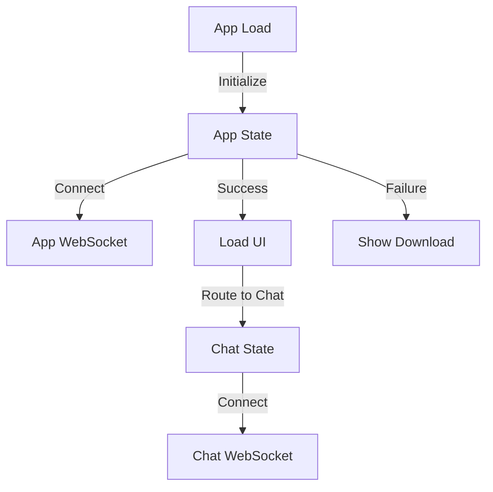
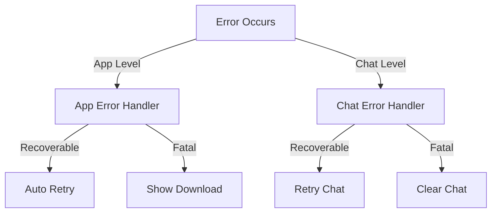
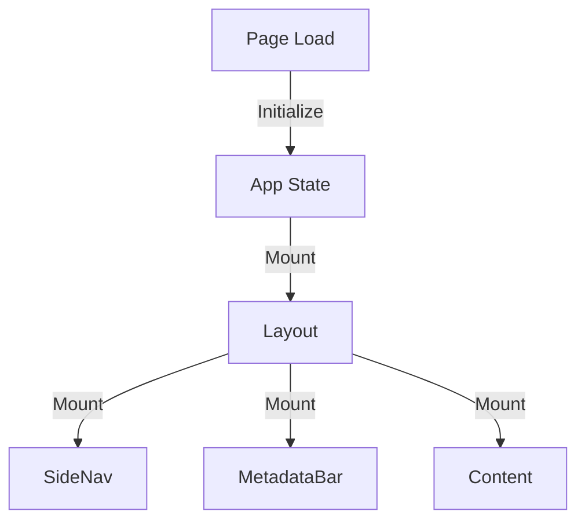

# BUI Current Refactoring Status

## Overview
The BUI is undergoing significant architectural changes to support multiple routes and enhanced features. This document tracks the current status of the refactoring effort.

## Completed Changes

### 1. Route Structure
- [x] Created new route organization
- [x] Moved chat to dedicated route
- [x] Added placeholder routes for projects and settings
- [x] Updated _app.tsx for new layout

### 2. Component Architecture
- [x] Created Layout component
- [x] Implemented SideNav
- [x] Added MetadataBar
- [x] Created basic page templates

### 3. Documentation
- [x] State management separation docs
- [x] Home page implementation docs
- [x] Updated component patterns
- [x] Progress summary

## In Progress

### 1. State Management
```typescript
// App State Implementation
interface AppState {
    wsManager: WebSocketManager;
    apiClient: ApiClient;
    status: {
        isConnecting: boolean;
        isReady: boolean;
        isLoading: boolean;
        error: string | null;
    };
}

// Chat State Remains Unchanged
interface ChatState {
    // Existing chat state interface
}
```

Status:
- [ ] Creating app state hook
- [ ] Adding WebSocket endpoint
- [ ] Implementing connection management
- [ ] Adding error handling

### 2. Home Page
- [ ] Connection status detection
- [ ] Download section
- [ ] Project quick access
- [ ] System status display

### 3. Project Management
- [ ] Project listing
- [ ] Project creation
- [ ] Project settings
- [ ] Access control

## Pending Work

### 1. API Changes
New endpoints needed:
```typescript
// New WebSocket endpoint
ws://localhost:3162/v1/ws/app

// New API endpoints
GET /api/v1/projects
POST /api/v1/projects
GET /api/v1/system/status
```

### 2. Component Updates
Components requiring updates:
- [ ] ProjectSelector
- [ ] StatusIndicator
- [ ] VersionDisplay
- [ ] ErrorBoundary

### 3. Migration Tasks
- [ ] Update existing components for new state
- [ ] Add new error handling
- [ ] Update tests
- [ ] Add migration docs

## Implementation Priorities

### Phase 1: Foundation (Current)
1. App State Implementation
   - Create useAppState hook
   - Add WebSocket endpoint
   - Implement connection management

2. Home Page
   - Connection detection
   - Download section
   - Basic layout

3. Documentation
   - Architecture docs
   - Implementation guides
   - Migration guides

### Phase 2: Core Features
1. Project Management
   - Project listing
   - Basic CRUD operations
   - Project settings

2. Navigation
   - Enhanced side nav
   - Project selector
   - Status indicators

3. Error Handling
   - Error boundaries
   - Recovery flows
   - User feedback

### Phase 3: Enhancement
1. User Settings
   - Preferences
   - Themes
   - Keyboard shortcuts

2. Performance
   - State optimization
   - Connection management
   - Caching strategy

3. Testing
   - Unit tests
   - Integration tests
   - Performance tests

## Technical Considerations

### 1. State Management


### 2. Error Handling


### 3. Component Lifecycle


## Migration Strategy

### 1. Incremental Updates
- Start with app state implementation
- Add new components gradually
- Update existing components last
- Maintain backwards compatibility

### 2. Testing Approach
- Test new components first
- Add integration tests
- Update existing tests
- Add performance tests

### 3. Documentation
- Update architecture docs
- Add migration guides
- Document new patterns
- Provide examples

## Next Steps

### Immediate Tasks
1. Complete app state implementation
2. Add new WebSocket endpoint
3. Create home page features
4. Update API endpoints

### Short-term Goals
1. Complete project management
2. Implement user settings
3. Enhance error handling
4. Add loading states

### Long-term Objectives
1. Performance optimization
2. Enhanced features
3. Team collaboration
4. Analytics integration

## References

1. Architecture
- [State Management Separation](./state_management_separation.md)
- [Component Patterns](./components.md)

2. Features
- [Home Page Implementation](../features/home_page.md)
- [Progress Summary](../progress_summary.md)

3. Development
- [Testing Strategy](../testing/strategy.md)
- [API Documentation](../../api/README.md)