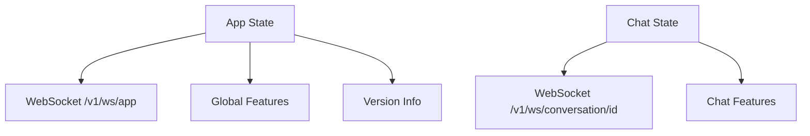
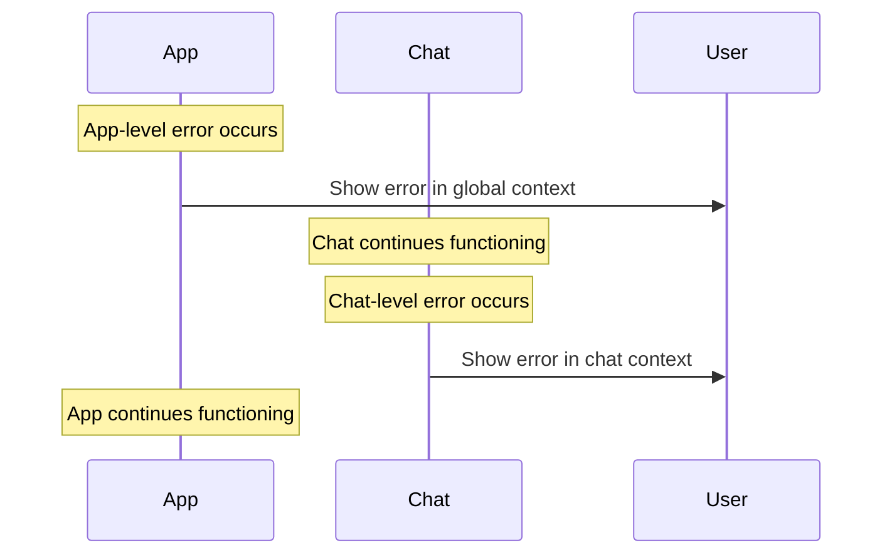

# BUI Enhancement Project Progress Summary

## Current Status
This document summarizes the progress of the BUI enhancement project, capturing key decisions and architectural changes. Use this as a starting point for new implementation conversations.

## Latest Changes

### 1. WebSocket Architecture
Implemented dual WebSocket connections with clear separation:
- App-level: `/v1/ws/app` for global features and version info
- Chat-level: `/v1/ws/conversation/<id>` for chat features

Each connection:
- Maintains its own state
- Handles its own errors independently
- Operates independently without race conditions

### 2. State Management
Completed separation of app and chat state:



Key characteristics:
- States operate independently
- No waiting dependencies between states
- Separate error handling
- Version info moved to app state

### 3. Component Architecture
- AppStateProvider added as root-level island
- SideNav updated to use app state
- Chat updated to use app state for version info
- Shared status display components

## Implementation Status

### 1. Completed Features
- WebSocket manager base implementation
- App-specific WebSocket manager
- Chat-specific WebSocket manager
- App state implementation
- Version info management in app state
- State separation architecture

### 2. In Progress
- Testing for regressions in chat island
- Moving conversation header elements to conversation metadata

### 3. Pending Work
- Regression testing
- Component updates
- Documentation updates

## Component Integration

### 1. AppStateProvider
```typescript
// Root-level island that manages app state
function AppStateProvider({ wsUrl, apiUrl }: AppStateProviderProps) {
    // Initializes app-level WebSocket
    // Manages version info and global state
}
```

### 2. State Dependencies
- App and chat states operate independently
- No waiting dependencies between states
- Each handles its own errors
- Version info managed by app state only

### 3. Error Handling Strategy


## Next Steps

### 1. Immediate Tasks
- Test for regressions in chat island
- Move conversation header elements to metadata
- Update documentation

### 2. Short-term Goals
- Complete regression testing
- Enhance error handling
- Update component organization

### 3. Long-term Objectives
- Enhance project features
- Add team collaboration
- Optimize performance

## Testing Requirements

### 1. Connection Testing
- App WebSocket connection
- Chat WebSocket connection
- Independent error recovery
- State independence verification

### 2. Component Testing
- AppStateProvider functionality
- SideNav with app state
- Chat with app state version info
- Error handling separation

### 3. Integration Testing
- State interactions
- Error propagation
- WebSocket independence
- Version info flow

## Documentation

### Key Documents
1. [State Management Separation](./architecture/state_management_separation.md)
2. [Component Patterns](./architecture/components.md)
3. [Testing Strategy](./testing/strategy.md)

## References

1. Architecture Documents
- [State Management Separation](./architecture/state_management_separation.md)
- [Component Patterns](./architecture/components.md)

2. Testing Documents
- [Testing Strategy](./testing/strategy.md)
- [Integration Testing](./testing/integration.md)