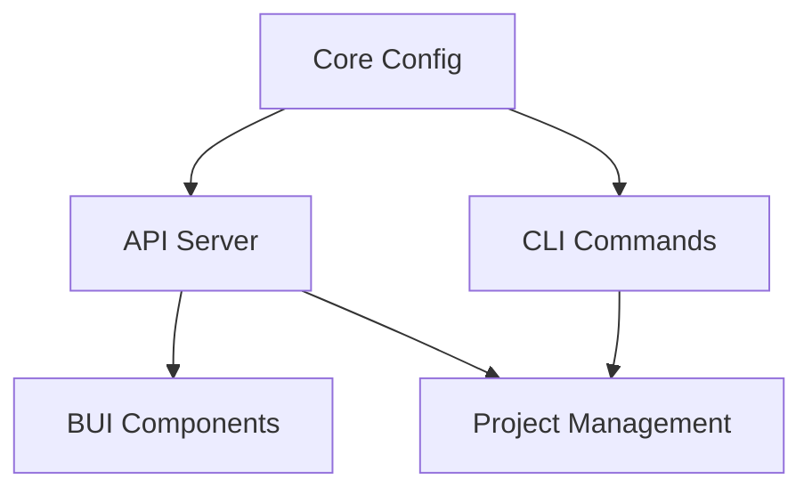

# Configuration Migration Task Breakdown

## Overview

This document breaks down the configuration migration tasks based on the usage analysis. Each task includes:
- File location
- Current usage pattern
- Required changes
- Test requirements
- Dependencies

## Task Groups

### Group 1: Core API Server
Priority: High
Dependencies: None

1. api/src/main.ts
```typescript
// Current:
const fullConfig = await ConfigManager.fullConfig(startDir);
const { environment, apiHostname, apiPort, apiUseTls } = fullConfig.api;

// Change to:
const config = await ConfigManagerV2.getInstance();
const apiConfig = await config.getApiConfig();
const { environment, hostname, port, useTls } = apiConfig;
```
Tests:
- Server starts with new config
- TLS configuration works
- Environment settings applied

### Group 2: LLM Integration
Priority: High
Dependencies: Group 1

1. api/src/llms/providers/baseLLM.ts
```typescript
// Current:
this.fullConfig = this.invokeSync(LLMCallbackType.PROJECT_CONFIG);

// Change to:
this.config = await ConfigManagerV2.getInstance();
this.llmConfig = await this.config.getLLMConfig();
```
Tests:
- LLM initialization works
- Cache settings applied
- API keys accessible

### Group 3: CLI Commands (✓ COMPLETED)

Migrated all CLI components to use ConfigManagerV2:
- Updated property names to match v2 structure
- Fixed method names and parameters
- Added type annotations
- Fixed variable scoping

Completed files:
Priority: Medium
Dependencies: Group 1

1. Commands:
- apiStart.ts and apiRestart.ts
- config.ts
- conversationChat.ts
- conversationList.ts
- init.ts
- secure.ts
- main.ts

2. Utils:
- apiClient.utils.ts
- apiControl.utils.ts
- apiStatus.utils.ts
- init.utils.ts
- logViewer.utils.ts
```typescript
// Current:
config = await ConfigManager.globalConfig();

// Change to:
const config = await ConfigManagerV2.getInstance();
const globalConfig = await config.getGlobalConfig();
```
Tests:
- Config commands work
- Settings displayed correctly
- Changes persist

2. cli/src/commands/apiStart.ts
```typescript
// Current:
const fullConfig = await ConfigManager.fullConfig(startDir);

// Change to:
const config = await ConfigManagerV2.getInstance();
const apiConfig = await config.getApiConfig();
```
Tests:
- API starts correctly
- Command options work
- Status reported correctly

### Group 4: BUI Components
Priority: Medium
Dependencies: Group 1

1. bui/src/fresh.config.ts
```typescript
// Current:
const { buiHostname, buiPort, buiUseTls } = fullConfig.bui;

// Change to:
const config = await ConfigManagerV2.getInstance();
const buiConfig = await config.getBuiConfig();
const { hostname, port, useTls } = buiConfig;
```
Tests:
- Server configuration works
- TLS settings applied
- Environment handled correctly

### Group 5: Project Management
Priority: High
Dependencies: Groups 1, 3

1. api/src/editor/projectEditor.ts
```typescript
// Current:
this.fullConfig = await ConfigManager.fullConfig(this.projectRoot);

// Change to:
this.config = await ConfigManagerV2.getInstance();
this.projectConfig = await this.config.getProjectConfig(projectId);
```
Tests:
- Project loading works
- Settings applied correctly
- Changes persist

## Implementation Progress

1. Phase 1: Core Configuration (✓ COMPLETED)
   - Implemented new ConfigManagerV2
   - Created migration utilities
   - Set up testing framework

2. Phase 2: CLI Migration (✓ COMPLETED)
   - Updated all CLI commands
   - Migrated utility functions
   - Fixed property and method names
   - Added type annotations

## Remaining Implementation Sequence

1. Phase 1: Core Configuration (Week 1)
   - Implement new ConfigManagerV2
   - Create migration utilities
   - Set up testing framework

1. Phase 3: API Server
   - Update server initialization
   - Migrate LLM configuration
   - Update project management

2. Phase 4: BUI Migration
   - Update config commands
   - Migrate API management
   - Update project handling


   - Update server config
   - Migrate WebSocket handling
   - Update chat state

3. Phase 5: Testing & Validation
   - Integration testing
   - Performance testing
   - Migration verification

## Test Requirements

### Unit Tests
Each changed file needs:
- Configuration loading tests
- Error handling tests
- Type validation tests

### Integration Tests
For each component:
- Cross-component communication
- Configuration persistence
- Error propagation

### Migration Tests
For each phase:
- Config format validation
- Data preservation
- Performance verification

## Validation Checklist

For each changed file:
- [ ] Old config patterns removed
- [ ] New config patterns implemented
- [ ] Tests written and passing
- [ ] Documentation updated
- [ ] No regression in functionality
- [ ] Performance verified

## Dependencies Graph



## Rollback Plan

Each change should include:
1. Backup of original file
2. Revert instructions
3. Test verification steps

## Success Criteria

For each component:
1. All tests passing
2. No old config patterns
3. Performance within bounds
4. No regressions

## Next Steps

1. Begin with Core Configuration:
   - Create ConfigManagerV2
   - Implement new interfaces
   - Set up testing framework

2. Review this breakdown with team
3. Schedule implementation phases
4. Set up monitoring for changes